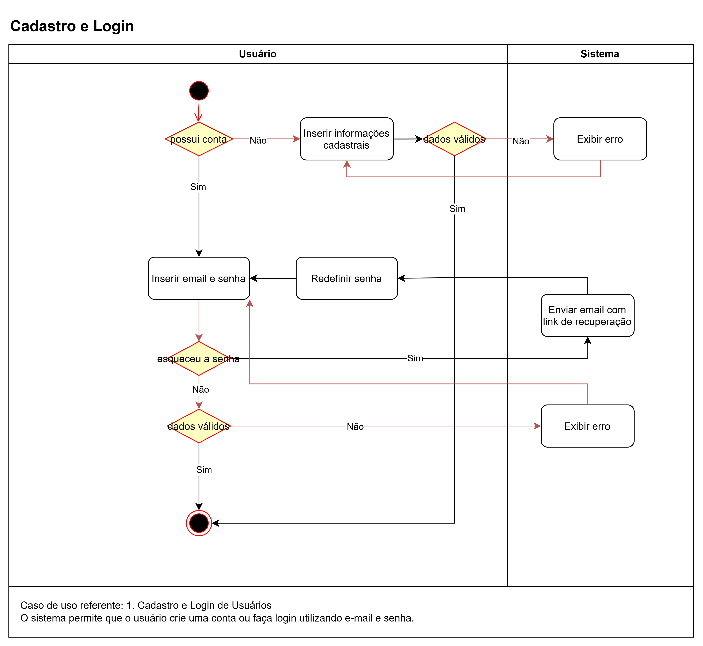
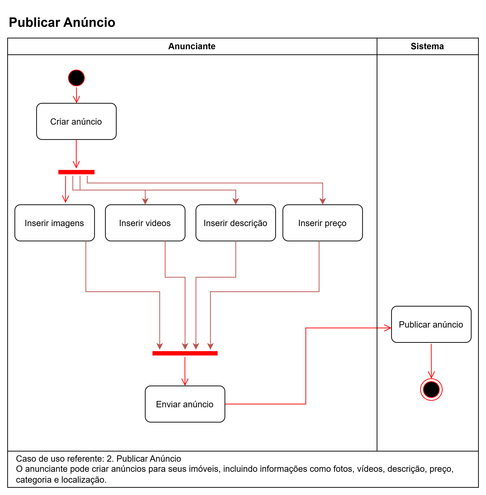
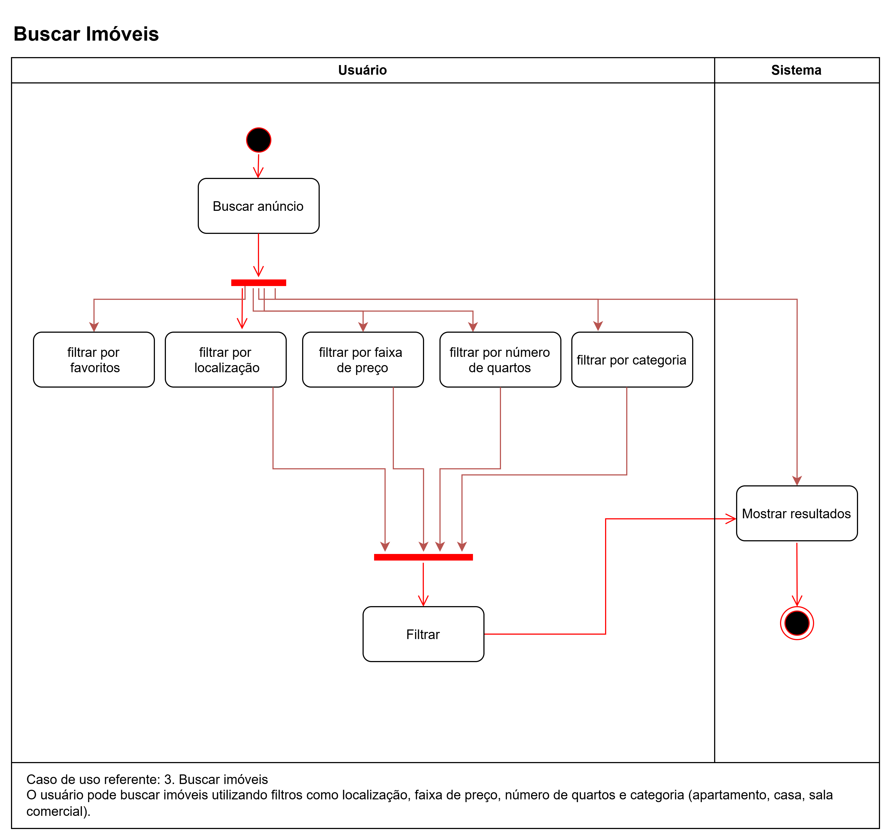
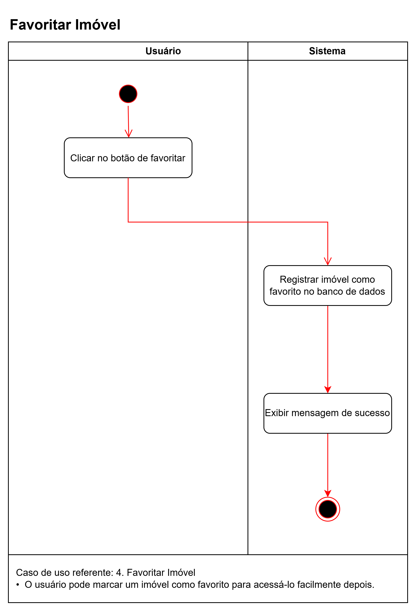
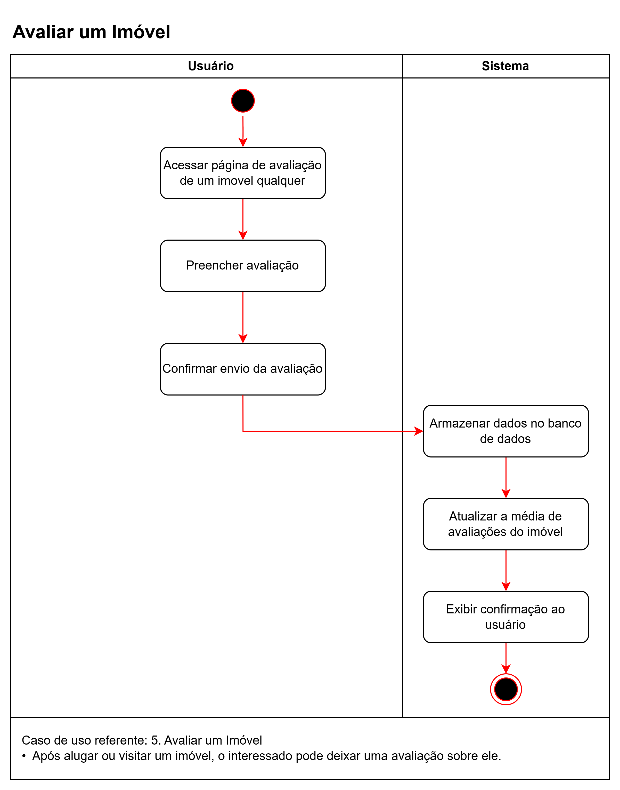
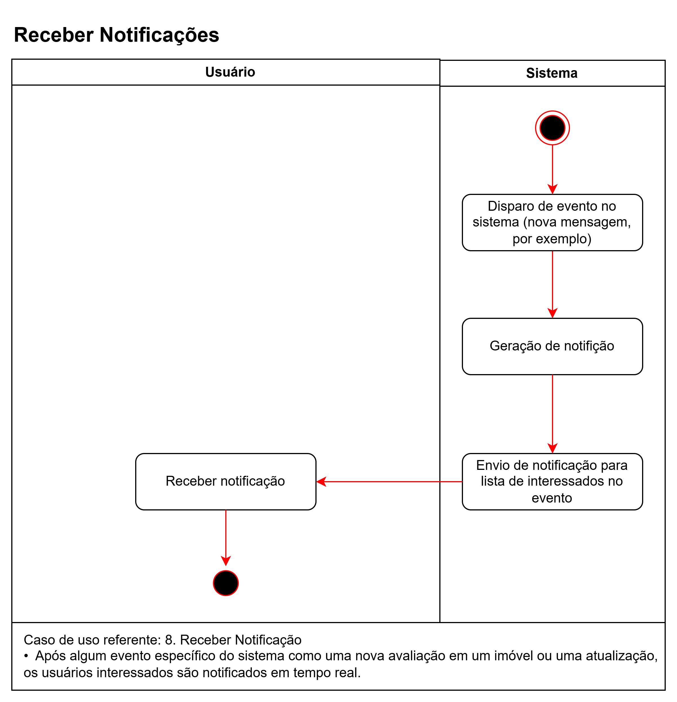
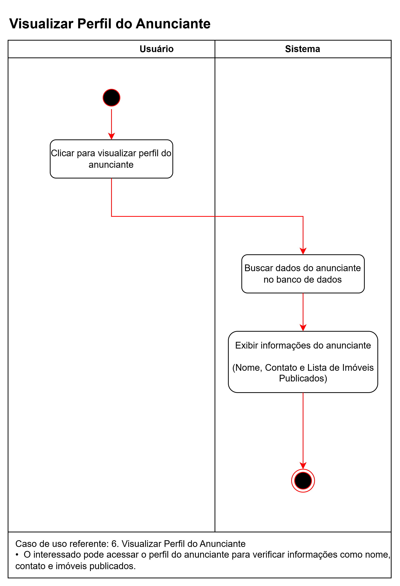
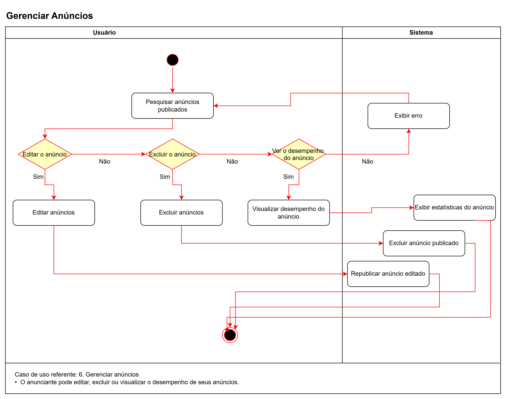

# 2.2. Módulo Notação UML – Modelagem Dinâmica

Foco_2: Modelagem UML Dinâmica.

Entrega Mínima: 1 Modelo Dinâmico (ESCOPO: Diagrama de Sequência; Diagrama de Atividades; Diagrama de Comunicação/Colaboração ou Diagrama de Estados).

Apresentação (em sala) explicando o modelo dinâmico especificado, com: (i) rastro claro aos membros participantes (MOSTRAR QUADRO DE PARTICIPAÇÕES & COMMITS); (ii) justificativas & senso crítico sobre o modelo, e (iii) comentários gerais sobre o trabalho em equipe. Tempo da Apresentação: +/- 5min. Recomendação: Apresentar diretamente via Wiki ou GitPages do Projeto. Baixar os conteúdos com antecedência, evitando problemas de internet no momento de exposição nas Dinâmicas de Avaliação.

A Wiki ou GitPages do Projeto deve conter um tópico dedicado ao Módulo Modelagem Dinâmica (Notação UML), com 1 modelo, histórico de versões, referências, e demais detalhamentos gerados pela equipe nesse escopo.

## Introdução

Este artefato apresenta os diagramas de modelagem dinâmica desenvolvidos para o **sistema HostHub**, com o objetivo de detalhar os aspectos comportamentais do sistema ao longo do tempo.

A modelagem dinâmica, dentro da notação UML (Unified Modeling Language), é fundamental para capturar o comportamento do sistema em sua execução, complementando a [modelagem estática](2.1.ModelagemEstatica.md), que descreve a estrutura do sistema. Por meio dos seus diagramas, a modelagem dinâmica permite a visualização clara dos processos, interações e transições de estados que compõem o funcionamento do sistema.

A importância da modelagem dinâmica está na capacidade de prever e documentar fluxos de execução do sistema, otimizando a comunicação entre os membros da equipe e stakeholders. Ela também auxilia na validação de requisitos, identificação de inconsistências e melhoria da compreensão dos processos internos do sistema.

## Metodologia

Para a criação dos diagramas, utilizamos a ferramenta [draw.io](https://www.drawio.com/), que oferece suporte para o desenvolvimento de diagramas de forma colaborativa, permitindo o compartilhamento e edição via nuvem através do Google Drive. Além disso, realizamos reuniões para discussão dos elementos a serem modelados.

Os diagramas foram elaborados em conformidade com as boas práticas da modelagem UML e revisados pela equipe. O escopo incluiu os seguintes diagramas dinâmicos:

1. **Diagrama de Estados**: Representa os estados pelos quais uma entidade pode passar, detalhando as transições e eventos que causam mudanças de estado.
2. **Diagrama de Atividades**: Descreve os fluxos de trabalho ou processos do sistema, enfatizando as atividades e decisões realizadas.
3. **Diagrama de Comunicação**: Ilustra a interação entre os objetos do sistema, destacando a troca de mensagens e colaboração entre eles.

## Diagramas de Modelagem Dinâmica

Abaixo são apresentados os diagramas de modelagem dinâmica desenvolvidos pela equipe, apresentando os principais aspectos do comportamento e das interações do sistema.

### Diagrama de Estados

### Diagrama de Atividades

1. Cadastro e Login de Usuários

2. Publicar Anúncio

3. Buscar Imóveis

4. Favoritar Imóvel

5. Avaliar um Imóvel

6. Receber Notificações

7. Visualizar Perfil do Anunciante

8. Gerenciar Anúncios

### Diagrama de Comunicação

