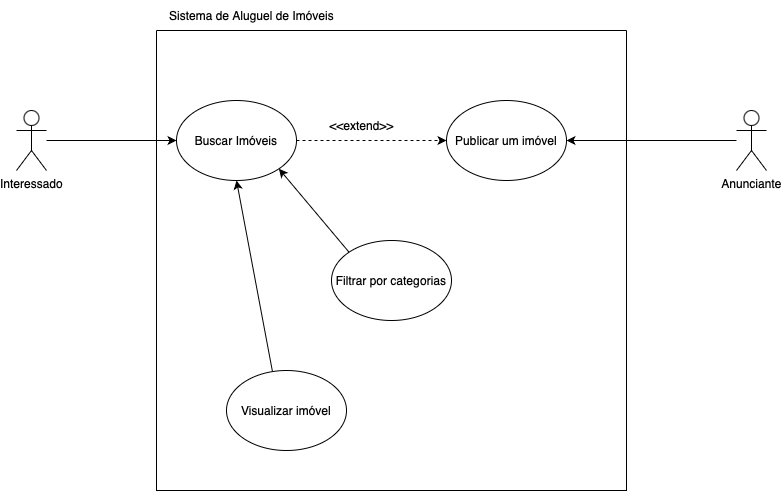

<!-- # 2.3. Módulo Notação UML – Modelagem Organizacional OU Casos de Uso

Foco_3: Modelagem Organizacional OU Casos de Uso.

Entrega Mínima: 1 Modelo, sendo esse o Diagrama de Pacotes ou o Diagrama de Casos de Uso.

Apresentação (em sala) explicando o modelo especificado, com: (i) rastro claro aos membros participantes (MOSTRAR QUADRO DE PARTICIPAÇÕES & COMMITS); (ii) justificativas & senso crítico sobre o modelo, e (iii) comentários gerais sobre o trabalho em equipe. Tempo da Apresentação: +/- 5min. Recomendação: Apresentar diretamente via Wiki ou GitPages do Projeto. Baixar os conteúdos com antecedência, evitando problemas de internet no momento de exposição nas Dinâmicas de Avaliação.

A Wiki ou GitPages do Projeto deve conter um tópico dedicado ao Módulo Modelagem Organizacional/Casos de Uso (Notação UML), com 1 modelo, histórico de versões, referências, e demais detalhamentos gerados pela equipe nesse escopo. -->

# Diagrama de Casos de Uso

## Introdução

Casos de uso são ferramentas essenciais na modelagem de sistemas e no desenvolvimento de software, amplamente utilizadas para capturar e documentar requisitos funcionais. Eles descrevem as interações entre os usuários (atores) e o sistema, ilustrando como as funcionalidades são executadas para alcançar objetivos específicos. Essa abordagem é centrada no usuário, o que ajuda a garantir que o sistema atenda às necessidades reais de quem irá utilizá-lo.

A principal finalidade dos casos de uso é comunicar de forma clara e objetiva o que o sistema deve fazer, servindo como uma ponte entre os stakeholders e a equipe técnica. Eles facilitam a identificação de requisitos, auxiliam na priorização de funcionalidades e promovem um entendimento compartilhado do escopo do projeto.

## Objetivo

O principal objetivo dos casos de uso é capturar e documentar os requisitos funcionais de um sistema de forma clara e compreensível, garantindo que todas as funcionalidades essenciais estejam alinhadas com as expectativas dos usuários e stakeholders. Eles servem como uma ferramenta de comunicação entre a equipe de desenvolvimento, analistas, gerentes de projeto e usuários finais, facilitando o entendimento comum sobre como o sistema deve se comportar em diferentes cenários.

Os casos de uso também têm como objetivo:

- Detalhar Interações: Explicar como os atores (usuários ou outros sistemas) interagem com o sistema para alcançar objetivos específicos.
- Identificar Requisitos Funcionais: Auxiliar na definição de o que o sistema deve fazer, sem se preocupar com como isso será implementado.
- Apoiar o Design e os Testes: Fornecer um ponto de partida para o design do sistema e para a criação de casos de teste que validem se os requisitos foram atendidos.

## Metodologia

A metodologia para desenvolver casos de uso envolve uma série de etapas estruturadas para garantir que os requisitos do sistema sejam bem documentados e compreendidos por todas as partes interessadas. As principais etapas incluem:

- Identificação dos Atores: Determinar os usuários ou sistemas que interagem com o sistema.
- Definição dos Objetivos: Estabelecer os objetivos que o sistema deve alcançar.
- Especificação dos Casos de Uso: Descrever as interações entre os atores e o sistema para atingir os objetivos, detalhando os cenários principais e alternativos.
- Elaboração de Diagramas: Utilizar diagramas UML para representar visualmente os casos de uso.

## Diagramas

### Buscar Imóveis

    

<figcaption align='center'>
    <h6><b>Figura 1: Diagrama de caso de uso para funcionalidade de buscar imóveis.   Autor(es): Gabriel Marcolino e Shaíne Oliveira</h6></b>
</figcaption>

## Referências

1. Diagrama de caso de uso UML: O que é, como fazer e exemplos. Diposnível em: <https://www.lucidchart.com/pages/pt/diagrama-de-caso-de-uso-uml#:~:text=um%20diagrama%20UML-,O%20que%20%C3%A9%20diagrama%20de%20caso%20de%20uso%3F,de%20s%C3%ADmbolos%20e%20conectores%20especializados.>. Acesso em: 20 de novembro de 2024.

## Histórico de Versão

| Versão |    Data    |                            Descrição                             |                                                  Autor(es)                                                  |
| :----: | :--------: | :--------------------------------------------------------------: | :---------------------------------------------------------------------------------------------------------: |
| `1.0`  | 20/11/2024 | Criação do dodumento e adição do caso de uso para buscar imóveis | [Gabriel Marcolino](https://github.com/GabrielMR360) e [Shaíne Oliveira](https://github.com/ShaineOliveira) |
