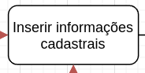
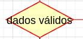
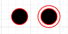
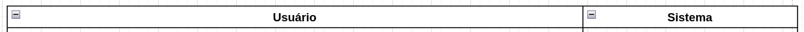

# Diagramas de Atividades

## Introdução

O diagrama de atividades é um diagrama UML de comportamento. Ele é focado em ações e controles de um fluxo sequencial com um objetivo pré-definido.

Esse diagrama possui alguns elementos frequentemente utilizados como:

- Nós de Atividade: Representados por retângulos com cantos arredondados, geralmente estão escritas no infinitivo para indicar ações.

- Decisões (Decision Nodes): Losangos que indicam pontos de decisão, onde o fluxo   pode seguir caminhos alternativos com base em condições (ex.: "Dados válidos?").

- Fluxo de Controle: Linhas com setas que conectam atividades, indicando a sequência de execução.

- Nó Inicial e Final: O nó inicial é representado por um círculo sólido e indica onde o fluxo começa. O nó final é um círculo com bordas duplas que indica o término do processo.

- Partições (Faixas de Responsabilidade): Divisões no diagrama que separam atividades por atores ou componentes do sistema, como "Usuário" e "Sistema".

## Diagramas de atividades do projeto

Foram feitos ao todo 8 diagramas de atividades, contemplando os casos de uso levantados pela equipe.

1. Cadastro e Login de Usuários

2. Publicar Anúncio

3. Buscar Imóveis

4. Favoritar Imóvel

5. Avaliar um Imóvel

6. Receber Notificações

7. Visualizar Perfil do Anunciante

8. Gerenciar Anúncios

<iframe frameborder="0" style="width:100%;height:2407px;" src="https://viewer.diagrams.net/?tags=%7B%7D&lightbox=1&highlight=0000ff&layers=1&nav=1&title=diagrama-atividades.drawio#Uhttps%3A%2F%2Fdrive.google.com%2Fuc%3Fid%3D13chmCSf_iAwLTdSAq3vO0_rD4YAO-PJU%26export%3Ddownload"></iframe>

## Referências Bibliográficas

[1] Activity Diagrams. Disponível em: https://www.uml-diagrams.org/activity-diagrams.html. Acesso em: 23 Novembro de 2024.

## Histórico de Versão

| Versão |    Data    |         Descrição          |  Autor(es)  |
| :----: | :--------: | :------------------------: | :---------: |
| `1.0`  | 23/11/2024 | Criação do dodumento | [Pedro Izarias](https://github.com/Izarias), [Pedro Sena](https://github.com/pedroyen21) |
| `1.1`  | 28/11/2024 | Adição dos diagramas de atividade | [Arthur Trindade](https://github.com/trindadea), [Gabriela Tiago](https://github.com/GabrielaTiago), [Miguel Moreira](https://github.com/EhOMiguel),  [Pedro Izarias](https://github.com/Izarias), [Pedro Sena](https://github.com/pedroyen21) |
| `1.2`  | 28/11/2024 | Correção de imagens| [Ester Lino](https://github.com/esteerlino) |
